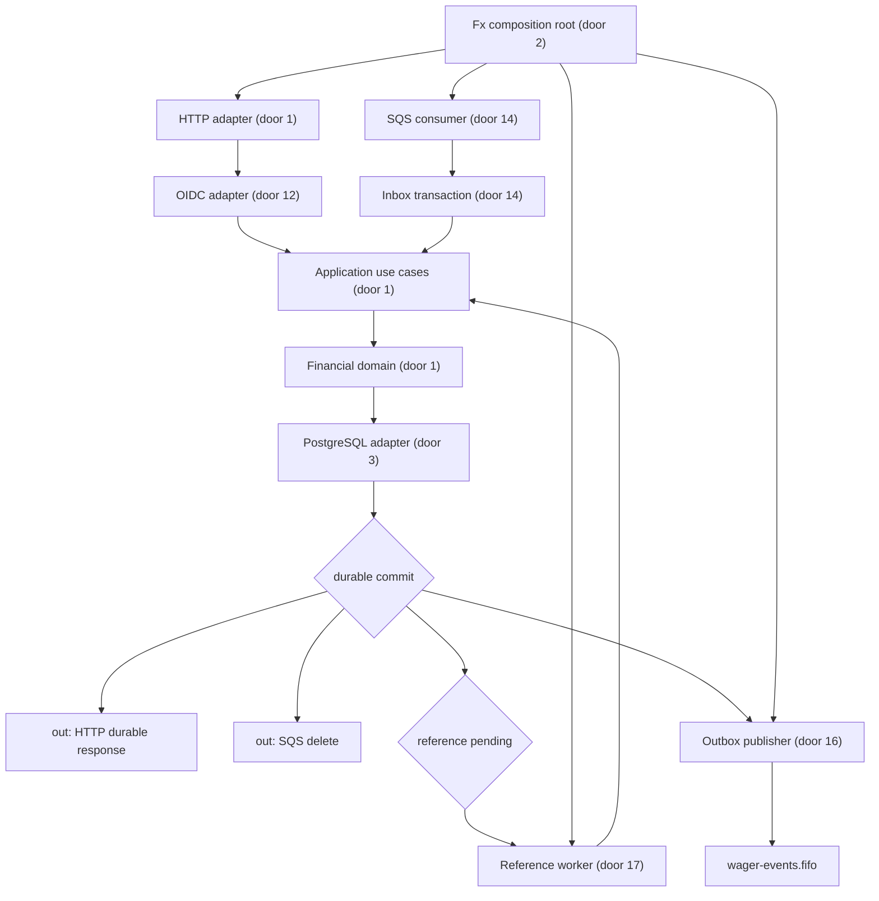
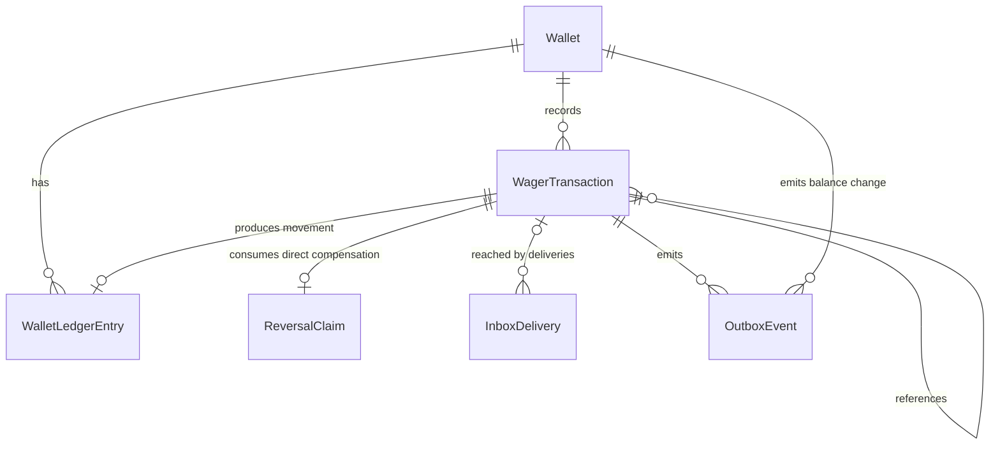

# Distributed wager processing

Sources:

- `prompts/README.md` - requisitos funcionais, contratos externos, garantias distribuídas, critérios de avaliação e entrega
- conversa de 2026-09-18 - arquitetura hexagonal, política de reversão por consumo único e perfil de verificação `standard`
- `go.mod` - módulo `github.com/wagnerfonseca/backend-challenge-go-junglegaming` e Go `1.27.1`
- AWS SQS `ReceiveMessage` API - `SenderId` identifica o IAM user ou role que enviou a mensagem
- LocalStack SQS documentation - suporte a FIFO, redrive, system attributes e múltiplas contas no ambiente local

## Problem

O repositório contém apenas o enunciado e a declaração do módulo Go. Hoje um avaliador não consegue iniciar um serviço, autenticar um provedor, movimentar uma carteira, auditar o ledger ou demonstrar que concorrência, reentrega e interrupções preservam o resultado financeiro. O custo é a impossibilidade de avaliar os 100 pontos descritos na fonte; não há evidência adicional de volume, latência ou prazo.

Quando esta entrega estiver pronta, outra pessoa conseguirá partir de um checkout limpo, iniciar três instâncias com dependências reais, enviar a mesma operação por HTTP e SQS, provocar falhas nos limites de commit/publicação e verificar um único resultado financeiro auditável.

## Out of scope

| Excluded | Why |
| --- | --- |
| Cadastro de usuários, senhas ou emissão própria de tokens | a fonte exige um IdP OAuth 2.0/OIDC externo |
| Interface web ou aplicativo cliente | o desafio expõe somente HTTP, mensageria, documentos e comandos operacionais |
| Reversões parciais | a fonte exige reversão integral |
| Ledger de partidas dobradas | a fonte o classifica como diferencial opcional |
| Tracing distribuído e dashboards | são diferenciais opcionais; logs, métricas e health checks permanecem obrigatórios |
| Teste de carga e meta de RPS | são opcionais e a fonte não define meta mínima |
| Correção automática pela reconciliação | a reconciliação deve apenas reportar divergências |
| Operação financeira externa em moeda diferente de BRL | a fonte permite limitar os cenários principais a BRL; o domínio ainda prova incompatibilidade entre moedas |
| Rate limit distribuído de negócio | não há quota de produto definida e adicionar Redis ou gateway ampliaria o escopo; limites de corpo, tempo e concorrência protegem recursos |
| Retenção, arquivamento ou expurgo automático de registros financeiros | o desafio exige auditabilidade e não define política legal de retenção; nenhum registro financeiro será removido automaticamente |
| Deploy, push remoto ou alteração de dados de produção | a entrega é local e reproduzível; essas ações exigem autorização separada |

## Assumptions

| Assumption | Chosen default | Rationale | Confirmed? |
| --- | --- | --- | --- |
| Arquitetura do serviço | hexagonal orientada ao domínio | mantém o núcleo financeiro puro e foi a opção recomendada aceita pelo usuário | y |
| Composição e lifecycle | Uber Fx apenas na raiz de composição e nos adaptadores | é obrigatório na fonte e não deve contaminar o domínio | y |
| Combinação de `REFUND` e `ROLLBACK` sobre uma `BET` | o primeiro `REFUND` ou `ROLLBACK` direto processado bloqueia o outro permanentemente; rollback do refund não reabre a bet | evita crédito duplicado e ciclos; política aceita pelo usuário | y |
| Perfil de verificação | `standard`, orçamento de 150k tokens | recomputa cobertura e exige injeção de falha; aceito pelo usuário | y |
| IdP local | Keycloak com realm importado e `client_credentials` | é a recomendação da fonte e permite testes reais reproduzíveis | y |
| Permissões HTTP | scopes `wagering:write`, `wagering:read`, `wallets:write`, `wallets:read`, `reconciliation:execute` e `metrics:read`; claim `provider_id` para clientes de provedor | separa provedores do cliente interno sem confiar no corpo ou path | y |
| Acesso por ID interno de transação | provedores podem consultar somente transações externas próprias; `OPENING` fica visível apenas ao cliente interno | preserva isolamento e mantém operações internas restritas | y |
| Biblioteca de banco e migrations | `pgx/v5` com SQL explícito e `golang-migrate` com arquivos `up`/`down` | segue a preferência da fonte e torna transações, locks e evolução verificáveis | y |
| Representação monetária | `int64` em centavos; entrada externa canônica `^(0|[1-9][0-9]*)\.[0-9]{2}$`; máximo `92233720368547758.07` | satisfaz escala fixa, serialização exata e limites verificáveis | y |
| Escopo de moedas | API aceita apenas `BRL`; o domínio também reconhece `USD` para provar incompatibilidade | limita o caso principal sem remover moeda do value object | y |
| Identificadores internos | UUIDv7 canônico para carteira, transação, ledger e evento | os exemplos usam UUIDs ordenáveis e IDs precisam ser estáveis entre instâncias | y |
| Limites de identificadores externos | `providerId` segue `[a-z0-9][a-z0-9._-]{0,63}`; demais IDs externos usam `[A-Za-z0-9._:-]{1,128}`; idempotency key usa ASCII visível de 1 a 255 bytes | impede entradas sem limite e mantém interoperabilidade com exemplos | y |
| Concorrência financeira | `SELECT ... FOR UPDATE` na carteira, em transação `READ COMMITTED`, com ordem determinística ao travar mais de uma linha | a operação comum toca uma carteira e o lock pessimista torna o resultado explícito | y |
| Aceite de operações sem dependência | processar e finalizar em uma única transação; nunca confirmar `PENDING` intermediário | remove uma retomada desnecessária e ainda satisfaz atomicidade | y |
| Referência opcional de `WIN` | se informada, deve apontar para `BET` da mesma identidade e rodada; se ainda não existir, a `WIN` entra em `PENDING_REFERENCE`; o valor não precisa ser igual | valida a informação opcional sem inventar movimento dependente do valor da aposta | y |
| Retry de referência | expira 24 horas após aceite; backoff começa em 1 s, dobra até 15 min e recebe jitter determinístico de até 10% | garante retomada durável, limita tempestade de retry e dá um prazo concreto | y |
| Referência pendente ou terminal sem sucesso | referência `PENDING`/`PENDING_REFERENCE` mantém espera; `REJECTED`/`FAILED` rejeita a dependente com `REFERENCE_NOT_PROCESSED` | somente uma referência processada pode fundamentar a operação | y |
| Falha permanente | `FAILED` é usado apenas por trabalho assíncrono já aceito que encontra erro não transitório de infraestrutura; indisponibilidade de PostgreSQL/SQS permanece transitória | evita transformar indisponibilidade recuperável em resultado terminal | y |
| Contrato de erro HTTP | `{"error":{"code":"UPPER_SNAKE","message":"safe text","correlationId":"uuid"}}`; rejeição financeira durável é resposta de transação com `status:"REJECTED"` e `failureCode` | separa falha de transporte/validação do resultado auditável do domínio | y |
| Status de `POST /wagering/transactions` | `200` para resultado durável processado/rejeitado e replay; `202` para `PENDING_REFERENCE`; `422` para comando semanticamente inválido sem registro; `503` antes de commit durável | resultado de negócio não é erro de transporte e pending é distinguível | y |
| Versionamento HTTP | rotas fornecidas são v1 implícita; mudança incompatível cria nova rota ou media type | preserva literalmente as rotas do desafio | y |
| Limites HTTP | corpo máximo de 1 MiB; read header 5 s, read 10 s, write 35 s, idle 60 s; reconciliação 30 s; máximo de 256 requests de negócio concorrentes por instância, com `503` e `Retry-After: 1` na saturação | fornece limites concretos sem inventar quota distribuída por provedor e permite concluir a reconciliação | y |
| Paginação do ledger | ordem crescente por criação e ID; cursor opaco base64url versionado; `limit` padrão 50, mínimo 1 e máximo 100 | evita saltos/duplicatas sob append concorrente e limita a resposta | y |
| SQS de entrada | long poll 20 s, lote 10, visibility timeout 60 s com renovação a cada 20 s, redrive após 5 recebimentos; erro transitório muda a visibilidade para `5s`, `10s`, `20s` ou `40s` conforme o receive count | fornece backoff concreto, permite shutdown seguro e entrega o quinto recebimento à DLQ | y |
| Vínculo de provedor no SQS | cada provedor usa IAM user/role próprio; o consumer solicita o system attribute `SenderId`, mapeia-o para um provedor configurado e exige igualdade com `data.providerId`; o Compose provisiona identidades LocalStack distintas | uma fila compartilhada não pode autorizar por provedor confiando somente no corpo; AWS documenta `SenderId` para user/role e LocalStack expõe system attributes | y |
| Identificadores FIFO de entrada | `MessageGroupId=walletId` e `MessageDeduplicationId=messageId` | serializa por carteira sem bloquear carteiras independentes; banco continua autoritativo | y |
| Destino de eventos | fila FIFO `wager-events.fifo`, `MessageGroupId=walletId`, `MessageDeduplicationId=eventId` | dá destino e ordem por agregado com identidade estável em republicação | y |
| Publicação da outbox | lotes de 50, lease de 30 s, backoff de 1 s até 5 min e retry sem limite enquanto não publicado | evento confirmado no banco não pode ser descartado por esgotar tentativas | y |
| Worker de referências | lotes de 50 e lease de 30 s, disputados com `SKIP LOCKED` | permite várias instâncias e recuperação de trabalho abandonado | y |
| Versionamento de eventos | todos começam em `version: 1`; timestamps UTC RFC 3339 com milissegundos; campos opcionais são omitidos, não enviados como `null` | fixa um contrato consumível e consistente | y |
| Retenção | transações, ledger, claims de reversão e idempotência não expiram; inbox e outbox também não são expurgados neste desafio; DLQ usa retenção de 14 dias | evita que replay antigo reaplique dinheiro e não inventa política de arquivo | y |
| Reconciliação | transação `REPEATABLE READ`, leitura integral do ledger, sem lock de escrita; timeout de 30 s retorna `503` sem resultado parcial | produz uma visão consistente sem bloquear movimentos por toda a varredura | y |
| Observabilidade | `log/slog` JSON e Prometheus em `GET /metrics`; nomes fixos `wager_transactions_total`, `wager_idempotency_duplicates_total`, `wager_retries_total`, `wager_dlq_total`, `wallet_concurrency_conflicts_total`, `outbox_oldest_pending_seconds`, `wager_processing_duration_seconds` e `wallet_reconciliation_divergences_total`; sem tracing opcional | usa biblioteca padrão para logs, fixa labels de baixa cardinalidade e entrega os sinais obrigatórios | y |
| Testes de interrupção | subprocessos reais recebem failpoints habilitados somente em binário de integração; configuração de produção rejeita failpoints | torna reproduzíveis as janelas entre commit, delete, publish e confirmação | y |

Taxonomia escolhida para respostas de borda:

| Class | Stable codes |
| --- | --- |
| autenticação/autorização | `UNAUTHORIZED`, `FORBIDDEN` |
| contrato HTTP | `INVALID_REQUEST`, `INVALID_MONEY`, `UNSUPPORTED_CURRENCY`, `PAYLOAD_TOO_LARGE`, `UNSUPPORTED_MEDIA_TYPE`, `IDEMPOTENCY_KEY_REQUIRED`, `REFERENCE_REQUIRED`, `INVALID_LOSS_AMOUNT`, `INVALID_CURSOR`, `INVALID_LIMIT` |
| conflito HTTP | `WALLET_ALREADY_EXISTS`, `IDEMPOTENCY_CONFLICT`, `EXTERNAL_TRANSACTION_CONFLICT` |
| dependência HTTP | `NOT_FOUND`, `SERVICE_UNAVAILABLE` |
| mensagem permanente | `INVALID_MESSAGE`, `INBOX_PAYLOAD_CONFLICT` |
| rejeição financeira persistida | `INSUFFICIENT_FUNDS`, `REVERSAL_INSUFFICIENT_FUNDS`, `REFERENCE_NOT_FOUND`, `REFERENCE_NOT_PROCESSED`, `REFERENCE_MISMATCH`, `REVERSAL_AMOUNT_MISMATCH`, `REFERENCE_KIND_NOT_ALLOWED`, `INVALID_WIN_REFERENCE`, `ALREADY_REVERSED` |
| falha assíncrona persistida | `PERMANENT_INFRASTRUCTURE_FAILURE` |

Erros de contrato são corrigíveis e não criam `WagerTransaction`; `failureCode` identifica um resultado definitivo já aceito e auditável. Mensagem permanente não é confirmada e segue o redrive até a DLQ.

**Open questions:** none - all resolved or logged above.

## Criteria

### S1: Serviço inicia, compõe dependências e encerra de forma segura (P1)

**Acceptance Criteria**

1. The repository SHALL declare Go `1.27.1` in `go.mod` and use Go `1.27.1` in the Docker build stage
2. The domain SHALL compile without imports of Fx, HTTP, SQS, PostgreSQL, OIDC, Prometheus, or logging adapters
3. WHEN the application graph is constructed THEN the system SHALL compose configuration, connections, repositories, use cases, handlers, and workers through `fx.Module`, `fx.Provide`, and `fx.Invoke`
4. IF required configuration, PostgreSQL, SQS, or OIDC discovery is invalid or unavailable at startup THEN the system SHALL exit non-zero before readiness becomes healthy
5. WHILE an HTTP request or worker operation is active the system SHALL propagate one `context.Context` through application and I/O boundaries
6. WHEN `SIGTERM` is received THEN the system SHALL stop accepting HTTP requests and stop polling SQS before starting resource shutdown
7. IF in-flight SQS work cannot finish within 30 seconds of `SIGTERM` THEN the system SHALL release its message visibility for redelivery
8. WHEN shutdown completes THEN the system SHALL close PostgreSQL and SQS resources only after HTTP and all workers have stopped
9. WHEN PostgreSQL, Keycloak, LocalStack, queue provisioning, and the application pass their Compose health checks THEN `docker compose up --build` SHALL leave one application instance in `ready`
10. The repository SHALL provide versioned forward and reverse migrations whose commands exit non-zero on failure
11. The PostgreSQL adapter SHALL use `pgx/v5` and explicit parameterized SQL for every query, transaction, lock, and constraint-dependent operation
12. The application SHALL expose no mutable package-global dependency or service locator

**Independent test:** iniciar o Compose, observar readiness, enviar `SIGTERM` durante uma mensagem e confirmar encerramento em ordem e reentrega segura.

### S2: Dinheiro e entidades preservam invariantes sem infraestrutura (P1)

**Acceptance Criteria**

13. The Money value SHALL never pass through `float32` or `float64` in parsing, arithmetic, serialization, hashing, or persistence
14. WHEN external money amount `25.00` and currency `BRL` are parsed THEN the system SHALL produce exactly `2500` minor units and serialize back to `{"amount":"25.00","currency":"BRL"}`
15. IF an external amount is empty, negative, `NaN`, `Infinity`, scientific notation, has leading zeroes, or does not have exactly two decimal places THEN the system SHALL reject it without rounding
16. IF an external amount exceeds `92233720368547758.07` THEN the system SHALL return a classified overflow error
17. IF addition, subtraction, or negation exceeds the `int64` range THEN the system SHALL return a classified overflow error and no wrapped value
18. IF arithmetic or comparison combines different currencies THEN the system SHALL return a classified currency-mismatch error
19. The Money value SHALL be immutable after construction
20. IF an external financial command uses a currency other than `BRL` THEN the system SHALL return `422` with code `UNSUPPORTED_CURRENCY`
21. The Wallet SHALL never expose a balance below `0.00`
22. WHEN a domain entity is created THEN the system SHALL reject an empty identity, invalid initial state, zero timestamp, or required zero Money before returning it
23. IF a terminal WagerTransaction receives another transition THEN the system SHALL return a classified invalid-transition error and preserve the terminal state
24. WHEN an entity is rehydrated THEN the system SHALL emit no event, apply no movement, and increment no version
25. IF an uninitialized Money, Wallet, WagerTransaction, or WalletLedgerEntry is used by a public domain operation THEN the system SHALL reject it
26. The domain error API SHALL be classifiable through `errors.Is` or `errors.As`
27. The business rejection path SHALL return a classified domain result instead of invoking `panic`

**Independent test:** executar os testes do domínio sem configurar banco, rede, Fx ou variáveis de ambiente.

### S3: Carteira abre com saldo e ledger auditável (P1)

**Acceptance Criteria**

28. WHEN the internal client opens a wallet with `1000.00 BRL` THEN the system SHALL return `201` with `id`, the requested `playerId`, balance `1000.00 BRL`, and version `1`
29. WHEN a wallet opens with a positive balance THEN the system SHALL persist one `OPENING` transaction in `PROCESSED` with a stable internal identity
30. WHEN a wallet opens with a positive balance THEN the system SHALL append one `CREDIT` ledger entry from `0.00 BRL` to the initial balance
31. WHEN a wallet opens with a positive balance THEN the system SHALL persist exactly one `WagerTransactionProcessed` outbox event
32. WHEN a wallet opens with `0.00 BRL` THEN the system SHALL return `201` with balance `0.00 BRL` and version `1`
33. WHEN a wallet opens with `0.00 BRL` THEN the system SHALL persist no `OPENING` transaction
34. WHEN a wallet opens with `0.00 BRL` THEN the system SHALL persist no ledger entry
35. WHEN a wallet opens with `0.00 BRL` THEN the system SHALL persist no financial outbox event
36. IF `(playerId, currency)` already owns a wallet THEN the system SHALL return `409` with code `WALLET_ALREADY_EXISTS` and add no credit
37. The PostgreSQL schema SHALL enforce one Wallet per `(playerId, currency)` independently of application checks
38. WHEN a processed operation changes an existing wallet balance after creation THEN the system SHALL increment its version by exactly `1`; operations without movement SHALL preserve the version
39. IF a movement currency differs from the wallet currency THEN the system SHALL reject the operation before changing balance
40. IF a debit would produce a negative balance THEN the system SHALL reject it before changing balance
41. WHEN a WalletLedgerEntry is constructed THEN the system SHALL require `balanceAfter = balanceBefore + money` for `CREDIT` or `balanceAfter = balanceBefore - money` for `DEBIT`
42. The PostgreSQL schema SHALL allow at most one ledger entry per `(walletId, transactionId)`
43. The application database role SHALL receive an authorization error for every `UPDATE` or `DELETE` attempted on the ledger

**Independent test:** abrir carteiras com saldo positivo e zero, consultar as linhas atômicas e tentar alterar e excluir o ledger com a role da aplicação.

### S4: Operação externa é persistente, idempotente e reproduz o resultado original (P1)

**Acceptance Criteria**

44. IF HTTP or SQS submits kind `OPENING` or a kind outside `BET`, `WIN`, `LOSS`, `REFUND`, and `ROLLBACK` THEN the system SHALL reject it as invalid external input
45. IF `POST /wagering/transactions` omits `Idempotency-Key` THEN the system SHALL return `400` with code `IDEMPOTENCY_KEY_REQUIRED` and persist nothing
46. WHEN a valid independent operation reaches `POST /wagering/transactions` THEN the system SHALL return `200` with `transactionId`, terminal `status`, persisted `balance`, and `idempotentReplay:false`
47. The idempotency digest SHALL be SHA-256 over canonical JSON `sha256-jcs-v1` containing provider, external transaction, player, wallet, round, game, kind, canonical money, and optional reference, excluding transport metadata and the idempotency key
48. WHEN the same provider key and equivalent business digest are received again THEN the system SHALL return the persisted result with `idempotentReplay:true` and add no movement, ledger row, or outbox row
49. IF the same provider key is received with a different business digest THEN the system SHALL return `409` with code `IDEMPOTENCY_CONFLICT` and preserve the first result
50. IF the same `(providerId, externalTransactionId)` is received under a different idempotency key THEN the system SHALL return `409` with code `EXTERNAL_TRANSACTION_CONFLICT` and preserve the first result
51. WHEN equivalent HTTP and SQS commands identify the same operation THEN the system SHALL produce one WagerTransaction and at most one financial movement
52. WHEN every application instance restarts THEN the system SHALL preserve all idempotency decisions in PostgreSQL
53. WHEN a terminal operation is replayed after later wallet movements THEN the system SHALL return the balance captured by the original operation
54. WHEN an external WagerTransaction is accepted THEN the system SHALL persist its internal/external identities, provider, key, digest version and value, wallet, player, round, game, kind, money, optional external reference, state, timestamps, and state-specific result snapshot
55. WHEN an operation has no unresolved dependency THEN the system SHALL move from `PENDING` to a terminal state before its first transaction commits
56. WHEN an operation has an unresolved reference THEN the system SHALL commit it as `PENDING_REFERENCE` with durable retry scheduling
57. The WagerTransaction state machine SHALL allow only `PENDING -> PENDING_REFERENCE|PROCESSED|REJECTED|FAILED` and `PENDING_REFERENCE -> PROCESSED|REJECTED|FAILED`
58. WHEN a WagerTransaction reaches `PROCESSED`, `REJECTED`, or `FAILED` THEN the system SHALL permit no later state change
59. WHEN a transaction is queried in `PENDING_REFERENCE` THEN the system SHALL return its status and reference deadline without reporting a terminal balance
60. WHEN a transaction is durably rejected THEN the system SHALL persist one stable `failureCode` and its observed wallet balance
61. IF accepted asynchronous work cannot continue because its persisted record violates an infrastructure invariant THEN the system SHALL end in `FAILED` with `PERMANENT_INFRASTRUCTURE_FAILURE` and no wallet movement
62. IF PostgreSQL is unavailable before a durable commit THEN HTTP SHALL return `503` and SQS SHALL leave the message for retry
63. The database SHALL enforce uniqueness for provider/idempotency key and provider/external transaction identity

**Independent test:** processar uma aposta, mover novamente a carteira e repetir a aposta por HTTP e SQS, incluindo chave conflitante, para observar o snapshot original e uma única movimentação.

### S5: Os cinco tipos externos e suas referências têm resultado financeiro definido (P1)

**Acceptance Criteria**

64. WHEN a `BET` with positive matching money has sufficient balance THEN the system SHALL debit exactly its amount and end in `PROCESSED`
65. IF a `BET` would exceed available balance THEN the system SHALL end in `REJECTED` with `INSUFFICIENT_FUNDS` and create no ledger entry
66. WHEN a `WIN` with positive matching money is valid THEN the system SHALL credit exactly its amount and end in `PROCESSED`
67. IF a `WIN` supplies a reference that is not yet present THEN the system SHALL enter `PENDING_REFERENCE`
68. IF `LOSS` money is not exactly `0.00` in the wallet currency THEN the system SHALL return `422` with code `INVALID_LOSS_AMOUNT` and persist no transaction
69. WHEN a `LOSS` is processed THEN the system SHALL append no ledger entry
70. WHEN a `LOSS` is processed THEN the system SHALL preserve wallet balance and version
71. WHEN a `LOSS` is processed THEN the system SHALL emit `WagerTransactionProcessed` and SHALL NOT emit `WalletBalanceChanged`
72. WHEN a valid `REFUND` references a processed `BET` THEN the system SHALL credit exactly the referenced bet amount
73. WHEN a valid `ROLLBACK` references a processed `BET`, `WIN`, or `REFUND` THEN the system SHALL apply exactly the opposite movement of the referenced transaction
74. IF `BET`, `WIN`, `REFUND`, or `ROLLBACK` has amount `0.00` THEN the system SHALL reject the input with `422`
75. IF `REFUND` or `ROLLBACK` omits `referenceExternalTransactionId` THEN the system SHALL reject the input with `422` and code `REFERENCE_REQUIRED`
76. The system SHALL resolve an external reference only by `(providerId, referenceExternalTransactionId)`
77. IF a reversal and its resolved reference differ in player, wallet, currency, or round THEN the system SHALL end the reversal in `REJECTED` with `REFERENCE_MISMATCH`
78. IF a reversal amount differs from its reference amount THEN the system SHALL end the reversal in `REJECTED` with `REVERSAL_AMOUNT_MISMATCH`
79. WHEN a `BET` receives its first successful direct `REFUND` or `ROLLBACK` THEN the system SHALL permanently consume that bet's direct compensation right
80. IF a transaction attempts a second direct compensation of a consumed `BET` THEN the system SHALL end it in `REJECTED` with `ALREADY_REVERSED`
81. WHEN a `ROLLBACK` of a processed `REFUND` succeeds THEN the system SHALL debit the refund amount without reopening the referenced `BET`
82. IF a reversal debit exceeds available balance THEN the system SHALL end in `REJECTED` with `REVERSAL_INSUFFICIENT_FUNDS`
83. WHEN a required reference is absent THEN the system SHALL persist `PENDING_REFERENCE` and exactly one `WagerTransactionPendingReference` event
84. WHILE a reference remains absent and its 24-hour deadline has not elapsed the system SHALL retry with exponential backoff starting at 1 second, capped at 15 minutes, and shifted by deterministic jitter up to 10%
85. WHILE a reference exists in `PENDING` or `PENDING_REFERENCE` the dependent transaction SHALL remain `PENDING_REFERENCE`
86. IF a reference ends in `REJECTED` or `FAILED` THEN the system SHALL end the dependent transaction in `REJECTED` with `REFERENCE_NOT_PROCESSED`
87. WHEN an unresolved reference reaches its 24-hour deadline THEN the system SHALL end in `REJECTED` with `REFERENCE_NOT_FOUND` and emit one `WagerTransactionRejected`
88. WHEN a reference arrives after its dependent transaction is terminal THEN the system SHALL leave the terminal result unchanged

**Independent test:** enviar cada tipo, enviar `REFUND` e `ROLLBACK` antes da referência, avançar o relógio até resolução ou expiração e disputar duas compensações da mesma bet.

### S6: Banco serializa por carteira e mantém atomicidade entre processos (P1)

**Acceptance Criteria**

89. WHEN an operation can change a wallet THEN the system SHALL lock that wallet row with `SELECT ... FOR UPDATE` before reading the balance used by the decision
90. WHILE one wallet is locked the system SHALL allow an operation on a different wallet to reach its commit independently
91. WHEN an operation commits THEN its transaction state, wallet balance/version, ledger entry, inbox completion, reversal claim, and outbox events applicable to that operation SHALL become visible atomically
92. The PostgreSQL schema SHALL enforce nonnegative wallet balance, financial uniqueness, ledger arithmetic, and reversal exclusivity independently of local locks and FIFO deduplication
93. WHEN concurrent writers target one wallet THEN the system SHALL preserve every committed balance update without a lost update
94. WHEN a `100.00 BRL` wallet receives distinct `80.00 BRL` bets concurrently THEN the system SHALL produce one `PROCESSED`, one `REJECTED/INSUFFICIENT_FUNDS`, final balance `20.00 BRL`, and exactly one debit ledger entry
95. WHEN either bet from the `80.00 BRL` dispute is replayed THEN the system SHALL preserve the same two results, `20.00 BRL` balance, and one debit
96. WHEN the same valid bet is submitted 50 times in parallel THEN the system SHALL produce one debit and one transaction result
97. WHEN the concurrency scenarios run through three independent application processes THEN the system SHALL produce the same balances and ledger cardinality as one process
98. IF a process stops before its financial SQL transaction commits THEN the system SHALL expose no partial state and permit safe retry
99. IF a process stops after financial commit but before acknowledging its ingress THEN the system SHALL return the committed result on redelivery without a second movement
100. IF PostgreSQL or SQS is temporarily unavailable THEN the system SHALL retain every previously committed financial result and outbox event for retry
101. The system SHALL use no process-global or database-global lock for wallet coordination

**Independent test:** executar as disputas em três processos, observar locks por carteira e matar processos dos dois lados do commit.

### S7: OIDC e políticas impedem acesso entre provedores (P1)

**Acceptance Criteria**

102. WHEN a client presents a Keycloak access token THEN the system SHALL validate signature, issuer, audience, expiry, the route scope from criterion 195, and `provider_id` where applicable
103. IF a business endpoint receives absent, invalid, or expired credentials THEN the system SHALL return `401` without financial effect or protected data
104. The authenticated `provider_id` claim SHALL be the provider authority for every provider operation
105. IF an authenticated provider supplies a different provider in body or path THEN the system SHALL return `403` without processing or revealing the other provider's data
106. IF a provider queries another provider's transaction by internal or external identity THEN the system SHALL return `404` with no transaction fields
107. IF a provider credential calls a wallet, ledger, reconciliation, metrics, or internal `OPENING` operation THEN the system SHALL return `403`
108. WHEN the internal client presents the exact scope from criterion 195 THEN the system SHALL access that internal route without requiring a `provider_id` claim
109. WHEN a provider uses `wagering:write` or `wagering:read` THEN the system SHALL submit or read only transactions matching its `provider_id`
110. The `GET /health/live` and `GET /health/ready` routes SHALL require no credential
111. The SQS ingress SHALL map the authenticated `SenderId` to one configured provider and require equality with `data.providerId` before invoking the financial use case

**Independent test:** obter tokens reais para provider A, provider B e serviço interno e cruzar cada token com todos os endpoints de negócio.

### S8: Leituras, paginação e reconciliação expõem uma visão consistente (P1)

**Acceptance Criteria**

112. WHEN the internal client gets an existing wallet THEN the system SHALL return `200` with `id`, `playerId`, `balance`, `version`, `createdAt`, and `updatedAt`
113. WHEN the internal client lists a ledger without `limit` THEN the system SHALL return at most 50 entries ordered by `(createdAt,id)` ascending and an opaque `nextCursor` when another entry exists
114. WHEN a ledger page has no entries THEN the system SHALL return `200` with `items:[]` and no `nextCursor`
115. IF a ledger cursor is invalid or `limit` is outside `1..100` THEN the system SHALL return `400` with code `INVALID_CURSOR` or `INVALID_LIMIT`
116. WHEN an authorized caller gets a transaction by internal ID THEN the system SHALL return its identity, provider when applicable, kind, money, reference, status, failure code, observed balance, and timestamps
117. WHEN a provider gets `/providers/{providerId}/wagering/transactions/{externalTransactionId}` THEN the system SHALL return the same transaction view selected by provider and external identity
118. WHEN a queried transaction is pending, rejected, or failed THEN the system SHALL expose its exact persisted status and applicable deadline or failure code
119. WHEN reconciliation starts THEN the system SHALL read wallet and complete ledger in one `REPEATABLE READ` snapshot
120. The reconciliation difference SHALL equal stored balance minus ledger credits plus ledger debits, represented in the wallet currency
121. WHEN reconciliation sees opening `1000.00 BRL` and bet `25.00 BRL` THEN the system SHALL report stored `975.00`, calculated `975.00`, difference `0.00`, `consistent:true`, and `checkedEntries:2`
122. WHEN reconciliation detects a nonzero difference THEN the system SHALL return that exact nonzero difference with `consistent:false`
123. The reconciliation operation SHALL perform no wallet, transaction, or ledger write
124. IF a transport or validation error occurs THEN the HTTP API SHALL return the common error envelope with a stable code and correlation ID
125. The HTTP contract SHALL distinguish invalid input `400|422`, authentication `401`, authorization `403`, absence `404`, conflict `409`, payload/media errors `413|415`, pending `202`, durable outcome `200|201`, and transient unavailability `503`
126. The supplied unprefixed HTTP routes SHALL remain the implicit v1 contract; incompatible changes SHALL use a new route or media type

**Independent test:** criar histórico, paginar sem saltos durante novos appends, consultar estados não terminais e reconciliar antes e depois de uma divergência controlada.

### S9: SQS usa inbox durável e só remove trabalho confirmado (P1)

**Acceptance Criteria**

127. WHEN local infrastructure is provisioned THEN the system SHALL create `wager-transactions.fifo` and `wager-transactions-dlq.fifo` with redrive after 5 receives
128. WHEN `WagerTransactionRequested` is received THEN the system SHALL validate envelope `messageId`, `type`, UTC `occurredAt`, and typed `data` including `idempotencyKey` before invoking the use case
129. The HTTP and SQS ingresses SHALL invoke the same financial application use case with the same canonical business projection
130. The PostgreSQL schema SHALL enforce one inbox record per `(consumerName,messageId)` and persist the received payload digest
131. WHEN SQS handling commits THEN inbox completion SHALL commit in the same SQL transaction as every applicable domain, wallet, ledger, reversal, and outbox change
132. WHEN a completed inbox message with the same digest is redelivered THEN the system SHALL delete it from SQS without invoking another financial movement
133. IF a known `(consumerName,messageId)` is redelivered with a different digest THEN the system SHALL classify it as permanent `INBOX_PAYLOAD_CONFLICT` and make no domain change
134. WHILE SQS handling has no durable commit the system SHALL NOT delete its message
135. WHEN a business rejection commits durably THEN the system SHALL delete its input message
136. IF SQS handling encounters a transient error THEN the system SHALL leave the message for redelivery
137. WHEN a message reaches 5 receives without durable completion THEN the system SHALL arrive in `wager-transactions-dlq.fifo`
138. WHILE polling SQS the system SHALL use long poll 20 seconds, batches up to 10, visibility 60 seconds, and visibility renewal every 20 seconds
139. The ingress message SHALL use `MessageGroupId=walletId` and `MessageDeduplicationId=messageId`
140. WHEN a missing reference is durably stored as `PENDING_REFERENCE` THEN the system SHALL complete its inbox and transfer continuation to the reference worker
141. WHEN `SIGTERM` occurs during SQS work THEN the consumer SHALL stop polling and finish or release every in-flight message within 30 seconds
142. WHEN HTTP and SQS race on one external operation THEN the system SHALL persist one result regardless of which ingress wins

**Independent test:** usar LocalStack real para repetir, alterar, redirigir e interromper mensagens, incluindo corrida contra HTTP.

### S10: Outbox publica eventos estáveis somente depois do commit (P1)

**Acceptance Criteria**

143. WHEN a financial transaction commits THEN every applicable event SHALL already exist as an outbox snapshot in that commit
144. The request path and SQS consumer SHALL NOT publish an integration event directly
145. WHEN an outbox row is due THEN one publisher SHALL claim it in a batch of at most 50 with a 30-second recoverable lease
146. IF publishing fails THEN the system SHALL retain the same event and retry from 1 second up to a 5-minute backoff without an attempt limit
147. IF a process stops after financial commit and before publication THEN another instance SHALL publish the pending event
148. IF a process stops after SQS accepts an event and before outbox confirmation THEN the system SHALL republish with the same `eventId`
149. The integration event envelope SHALL contain `eventId`, `eventType`, `aggregateId`, `correlationId`, optional `causationId`, `occurredAt`, `version`, and typed `data`
150. The event serialization SHALL use version `1`, UTC RFC 3339 timestamps with milliseconds, and decimal-string money
151. WHEN an external operation or positive-balance `OPENING` reaches `PROCESSED` THEN the system SHALL persist exactly one `WagerTransactionProcessed`
152. WHEN an accepted business operation reaches `REJECTED` THEN the system SHALL persist exactly one `WagerTransactionRejected`
153. WHEN and only when wallet balance changes THEN the system SHALL persist exactly one `WalletBalanceChanged`
154. WHEN a transaction first enters `PENDING_REFERENCE` THEN the system SHALL persist exactly one `WagerTransactionPendingReference`
155. The `WalletBalanceChanged.data` payload SHALL contain `walletId`, `transactionId`, `direction`, `money`, `balanceBefore`, `balanceAfter`, and `walletVersion`
156. The event data schemas SHALL be `Processed{transactionId,origin,providerId?,externalTransactionId?,walletId,playerId,roundId?,gameId?,kind,money,balance}`, `Rejected{transactionId,providerId,externalTransactionId,walletId,kind,money,failureCode,balance,referenceExternalTransactionId?}`, and `PendingReference{transactionId,providerId,externalTransactionId,walletId,kind,money,referenceExternalTransactionId,expiresAt}`
157. WHEN an event is sent to `wager-events.fifo` THEN the system SHALL use `MessageGroupId=walletId` and `MessageDeduplicationId=eventId`
158. WHEN publication metadata changes THEN the system SHALL preserve event identity, type, version, aggregate, occurrence time, and payload bytes

**Independent test:** disputar um lote com dois publishers e matar um processo antes do envio e depois do envio, comprovando recuperação e `eventId` estável.

### S11: Saúde e observabilidade tornam falhas diagnosticáveis sem vazar dados (P1)

**Acceptance Criteria**

159. WHEN `GET /health/live` reaches a running process THEN the system SHALL return `200` with `{"status":"live"}` without consultar dependências
160. WHEN PostgreSQL and SQS respond within 2 seconds THEN `GET /health/ready` SHALL return `200` with `{"status":"ready"}`; otherwise it SHALL return `503` with `{"status":"not_ready"}`
161. WHEN an internal metrics client with `metrics:read` calls `GET /metrics` THEN the system SHALL return Prometheus text format
162. The metrics endpoint SHALL expose `wager_transactions_total{kind,status,ingress}`, `wager_idempotency_duplicates_total{ingress}`, `wager_retries_total{worker,reason}`, `wager_dlq_total{reason}`, `wallet_concurrency_conflicts_total`, `outbox_oldest_pending_seconds`, `wager_processing_duration_seconds{ingress,kind,status}`, and `wallet_reconciliation_divergences_total`
163. The application log record SHALL be JSON and include timestamp, level, message, service, instance, and each available correlation, message, transaction, wallet, and provider identifier
164. The application logs SHALL contain no credential, access token, complete request body, complete financial payload, or unbounded error detail
165. WHEN work crosses HTTP, SQS, inbox, reference retry, or outbox publication THEN the system SHALL preserve its correlation ID in logs and events
166. IF a permanent asynchronous failure produces `FAILED` THEN the system SHALL increment a failure metric and emit one structured audit log
167. The financial transactions, ledger, reversal claims, inbox, and outbox records SHALL have no automatic deletion path in this delivery

**Independent test:** provocar cada status, retry, DLQ, conflito, atraso e divergência e consultar logs, métricas e health sem encontrar payload ou credencial.

### S12: A entrega prova as garantias com infraestrutura real e é reproduzível (P1)

**Acceptance Criteria**

168. WHEN `go test ./...` runs from a configured checkout THEN the system SHALL pass unit tests for Money, Wallet, state transitions, all operation kinds, idempotency conflict, and internal `OPENING`
169. WHEN integration tests run with their documented build tag THEN the system SHALL use real PostgreSQL, Keycloak, and LocalStack containers rather than replacing all three with mocks
170. The integration test suite SHALL apply and reverse every migration and exercise database constraints and ledger write denial
171. The integration test suite SHALL prove absent, invalid, and expired credentials, provider isolation, and internal-scope restrictions against Keycloak
172. The integration test suite SHALL submit one bet 50 times in parallel and observe one debit
173. The integration test suite SHALL submit two `80.00 BRL` bets against `100.00 BRL` and observe one success, one insufficient-funds rejection, `20.00 BRL`, and one debit
174. The integration test suite SHALL process distinct wallets concurrently without waiting on one wallet-global lock
175. The integration test suite SHALL run criteria 172-180 through at least three independent application processes with separate memory and connections
176. The integration test suite SHALL interrupt a consumer after commit and before SQS delete and observe safe redelivery
177. The integration test suite SHALL run two publishers against one outbox and observe abandoned-lease recovery
178. The integration test suite SHALL deliver two early instances of each `REFUND` and `ROLLBACK`, then resolve one by a late reference and reject the other at its 24-hour expiry
179. The integration test suite SHALL restart all application processes and preserve idempotency, pending references, outbox work, balances, and ledger consistency
180. The integration test suite SHALL cross HTTP and SQS for the same operation and observe one financial result
181. The integration test suite SHALL compare every tested stored balance with opening plus ledger credits minus ledger debits
182. The integration test suite SHALL start and stop the Fx graph and observe all worker goroutines and resources terminate
183. WHEN `go test -race ./...` and the documented integration race command run THEN the system SHALL report no data race
184. WHEN `go vet ./...` runs THEN the system SHALL exit `0`
185. The solution README SHALL use direct Portuguese instructions to document prerequisites, environment variables, all queue and IdP identities, migrations up/down, startup, authenticated calls, unit/integration/race/vet commands, three-instance execution, DLQ redrive, and fault simulation
186. The `ARCHITECTURE.md` document SHALL use decision-oriented Portuguese prose to cover Money, SQL boundary, idempotency projection, locks, state machine, complete failure-code catalog, transient/permanent classifier, pending-reference policy, reversals, inbox, SQS visibility/redrive, outbox, outbound consumption contract, authentication, authorization, Fx lifecycle, shutdown, limitations, and unfinished work
187. The `.env.example` file SHALL use commented `KEY=value` entries with local example values and no real secret
188. WHEN `docker compose up --build`, `go test ./...`, `go test -race ./...`, or `go vet ./...` fails THEN its command SHALL exit non-zero with actionable output
189. The delivered Go source SHALL be `gofmt`-formatted

**Independent test:** executar todos os comandos documentados a partir de um checkout limpo, incluindo três processos e os failpoints de integração.

### S13: Todas as operações monetárias bem-sucedidas têm valor exato (P1)

**Acceptance Criteria**

190. WHEN zero is created for `BRL` THEN the system SHALL serialize it as `{"amount":"0.00","currency":"BRL"}`
191. WHEN `10.00 BRL` and `2.50 BRL` are added THEN the system SHALL return `12.50 BRL`
192. WHEN `10.00 BRL` is subtracted from `2.50 BRL` in an internal calculation THEN the system SHALL return `-7.50 BRL`
193. WHEN `2.50 BRL` is negated THEN the system SHALL return `-2.50 BRL`
194. WHEN `2.50 BRL` is compared with `10.00 BRL` THEN the system SHALL report the first value as less than the second

**Independent test:** executar somente a API pública de Money para zero, soma, subtração, negação e comparação.

### S14: Escopos e broker vinculam cada entrada à identidade autorizada (P1)

**Acceptance Criteria**

195. The HTTP scope map SHALL require `wallets:write` for `POST /wallets`, `wallets:read` for wallet and ledger reads, `reconciliation:execute` for reconciliation, `metrics:read` for metrics, `wagering:write` for wager submission, and `wagering:read` for transaction reads
196. IF a valid token lacks the exact route scope THEN the system SHALL return `403` before invoking its application use case
197. The input queue policy SHALL allow provider principals only `SendMessage` and allow the consumer principal only `ReceiveMessage`, `DeleteMessage`, `ChangeMessageVisibility`, and `GetQueueAttributes`
198. WHEN the SQS consumer receives a message THEN the system SHALL request `SenderId` and `ApproximateReceiveCount` system attributes
199. The output queue policy SHALL allow only the outbox publisher principal to call `SendMessage` and `GetQueueAttributes`
200. IF `WagerTransactionRequested.data.idempotencyKey` is absent, empty, or longer than 255 bytes THEN the system SHALL classify the message as permanent `INVALID_MESSAGE`
201. WHEN SQS accepts `data.idempotencyKey` THEN the system SHALL use it unchanged in the same provider-scoped idempotency lookup as the HTTP header
202. IF a transient SQS handling failure occurs at receive counts 1, 2, 3, or 4 THEN the system SHALL change message visibility to `5`, `10`, `20`, or `40` seconds respectively
203. IF a message is classified as permanently invalid THEN the system SHALL leave it unacknowledged until the configured redrive moves it to the DLQ
204. WHEN local queue provisioning completes THEN the system SHALL create `wager-events.fifo` in addition to both required ingress queues

**Independent test:** usar identidades separadas para providers, consumer e publisher, negar cada ação não concedida e observar backoff, idempotency key e redrive.

### S15: Toda referência permitida ou proibida tem estado terminal definido (P1)

**Acceptance Criteria**

205. WHEN a `WIN` references a processed `BET` with matching provider, player, wallet, currency, and round THEN the system SHALL persist the resolved internal reference and process the win
206. IF a `WIN` reference resolves to another kind or mismatched identity THEN the system SHALL end in `REJECTED` with `INVALID_WIN_REFERENCE`
207. IF a `REFUND` reference resolves to a kind other than `BET` THEN the system SHALL end in `REJECTED` with `REFERENCE_KIND_NOT_ALLOWED`
208. IF a `ROLLBACK` reference resolves to a kind other than `BET`, `WIN`, or `REFUND` THEN the system SHALL end in `REJECTED` with `REFERENCE_KIND_NOT_ALLOWED`
209. IF a processed `WIN` receives another `ROLLBACK` after one successful rollback THEN the system SHALL reject the later attempt with `ALREADY_REVERSED`
210. IF a processed `REFUND` receives another `ROLLBACK` after one successful rollback THEN the system SHALL reject the later attempt with `ALREADY_REVERSED`
211. WHEN any supplied reference resolves to an existing transaction THEN the system SHALL persist that internal transaction identity in the same commit as its resulting `PROCESSED` or `REJECTED` state
212. The PostgreSQL schema SHALL allow at most one `OPENING` transaction per wallet

**Independent test:** percorrer o produto cartesiano de tipo e estado da referência para WIN, REFUND e ROLLBACK, incluindo duas disputas de rollback.

### S16: Contratos operacionais têm limites e efeitos observáveis (P1)

**Acceptance Criteria**

213. WHILE 256 business HTTP requests are active in one instance the system SHALL return `503` with `Retry-After: 1` to the next business request
214. WHEN reconciliation detects a nonzero difference THEN the system SHALL increment `wallet_reconciliation_divergences_total` by exactly `1`
215. WHEN reconciliation detects a nonzero difference THEN the system SHALL write one JSON log containing `walletId`, `storedBalance`, `calculatedBalance`, and `difference`
216. WHEN an event constructor returns an event THEN the system SHALL set its own `eventType` and `version:1` without caller-supplied overrides
217. IF production configuration enables an integration failpoint THEN the system SHALL reject startup with a non-zero exit
218. IF any required external provider, transaction, player, wallet, round, or game identity is empty or outside its documented format THEN the system SHALL return `422` and persist no WagerTransaction
219. The `go.mod` and `go.sum` files SHALL pin every non-standard imported module needed by a clean checkout
220. The metric names, types, and label names in criterion 162 SHALL remain the v1 Prometheus contract
221. IF a reference external ID exists only under another provider THEN the system SHALL treat it as absent and reveal no referenced transaction field
222. WHEN an internal `OPENING` is persisted THEN the system SHALL require wallet, player, currency, amount, state, and timestamps while storing no provider, external ID, external key, external digest, round, game, or reference
223. IF an HTTP request body exceeds 1 MiB THEN the system SHALL return `413` with code `PAYLOAD_TOO_LARGE` before decoding the command
224. The HTTP server SHALL use read-header timeout 5 seconds, read timeout 10 seconds, write timeout 35 seconds, idle timeout 60 seconds, and reconciliation deadline 30 seconds
225. WHEN multiple reference workers poll due work THEN each item SHALL be owned by one 30-second lease in a claimed batch of at most 50
226. WHEN HTTP receives an `Idempotency-Key` THEN the system SHALL store and use its exact supplied value without substituting `{providerId}:{externalTransactionId}`
227. IF `POST /wallets` or `POST /wagering/transactions` receives a content type other than `application/json` THEN the system SHALL return `415` with code `UNSUPPORTED_MEDIA_TYPE`
228. WHEN a ledger entry is persisted THEN the system SHALL store its ID, wallet ID, transaction ID, direction, money, balance before, balance after, and creation time
229. WHEN an inbox delivery is persisted THEN the system SHALL store consumer name, message ID, digest, receipt time, and optional completion time
230. The PostgreSQL schema SHALL require every persisted ledger balance before and balance after to be at least zero
231. WHEN a WagerTransaction ends in `REJECTED` THEN the system SHALL persist no ledger entry for it

**Independent test:** saturar a entrada, provocar divergência, construir eventos, ativar failpoint proibido e validar limites de identidade e contratos versionados.

## Traceability

| ID | Slice | Criteria | Status |
| --- | --- | --- | --- |
| RUN-01 | S1 | 1-12 | Pending |
| DOM-01 | S2 | 13-27 | Pending |
| WAL-01 | S3 | 28-43 | Pending |
| IDEM-01 | S4 | 44-63 | Pending |
| WAGER-01 | S5 | 64-88 | Pending |
| CONC-01 | S6 | 89-101 | Pending |
| AUTH-01 | S7 | 102-111 | Pending |
| READ-01 | S8 | 112-126 | Pending |
| INBOX-01 | S9 | 127-142 | Pending |
| OUTBOX-01 | S10 | 143-158 | Pending |
| OBS-01 | S11 | 159-167 | Pending |
| TEST-01 | S12 | 168-189 | Pending |
| MONEY-02 | S13 | 190-194 | Pending |
| BROKER-01 | S14 | 195-204 | Pending |
| REF-01 | S15 | 205-212 | Pending |
| CONTRACT-01 | S16 | 213-231 | Pending |

## Observable

Cada item de cada superfície externa está resolvido abaixo. Não há tela.

| Surface | Decision | Landing |
| --- | --- | --- |
| API `POST /wallets` | response shape | AC 28, 32 |
| API `POST /wallets` | error shape and codes | AC 36, 124, 125, 223, 227 |
| API `POST /wallets` | who may call it | AC 107, 108 |
| API `POST /wallets` | versioning | AC 126 |
| API `POST /wallets` | rate limit behaviour | AC 213 - não há quota de produto; o limite é de concorrência por instância |
| API `GET /wallets/{walletId}` | response shape | AC 112 |
| API `GET /wallets/{walletId}` | error shape and codes | AC 124, 125 |
| API `GET /wallets/{walletId}` | who may call it | AC 107, 108 |
| API `GET /wallets/{walletId}` | versioning | AC 126 |
| API `GET /wallets/{walletId}` | rate limit behaviour | AC 213 - não há quota de produto; o limite é de concorrência por instância |
| API `GET /wallets/{walletId}/ledger` | response shape | AC 113, 114, 115 |
| API `GET /wallets/{walletId}/ledger` | error shape and codes | AC 115, 124, 125 |
| API `GET /wallets/{walletId}/ledger` | who may call it | AC 107, 108 |
| API `GET /wallets/{walletId}/ledger` | versioning | AC 126 e cursor versionado |
| API `GET /wallets/{walletId}/ledger` | rate limit behaviour | AC 113, 115, 213 - página e concorrência limitam custo sem quota por identidade |
| API `GET /wagering/transactions/{transactionId}` | response shape | AC 116, 118 |
| API `GET /wagering/transactions/{transactionId}` | error shape and codes | AC 106, 124, 125 |
| API `GET /wagering/transactions/{transactionId}` | who may call it | AC 106, 108, 109 |
| API `GET /wagering/transactions/{transactionId}` | versioning | AC 126 |
| API `GET /wagering/transactions/{transactionId}` | rate limit behaviour | AC 213 - não há quota de produto; o limite é de concorrência por instância |
| API `GET /providers/{providerId}/wagering/transactions/{externalTransactionId}` | response shape | AC 117, 118 |
| API `GET /providers/{providerId}/wagering/transactions/{externalTransactionId}` | error shape and codes | AC 105, 106, 124, 125 |
| API `GET /providers/{providerId}/wagering/transactions/{externalTransactionId}` | who may call it | AC 104, 105, 109 |
| API `GET /providers/{providerId}/wagering/transactions/{externalTransactionId}` | versioning | AC 126 |
| API `GET /providers/{providerId}/wagering/transactions/{externalTransactionId}` | rate limit behaviour | AC 213 - não há quota de produto; o limite é de concorrência por instância |
| API `POST /wagering/transactions` | response shape | AC 46, 48, 59, 60 |
| API `POST /wagering/transactions` | error shape and codes | AC 45, 49, 50, 62, 68, 74, 75, 124, 125, 223, 227 |
| API `POST /wagering/transactions` | who may call it | AC 102-105, 109 |
| API `POST /wagering/transactions` | versioning | AC 47, 126 |
| API `POST /wagering/transactions` | rate limit behaviour | AC 213 - máximo de 256 requests concorrentes retorna `503` na saturação |
| API `POST /wallets/{walletId}/reconciliation` | response shape | AC 119-123 |
| API `POST /wallets/{walletId}/reconciliation` | error shape and codes | AC 124, 125 e timeout de 30 s como `503` |
| API `POST /wallets/{walletId}/reconciliation` | who may call it | AC 107, 108 |
| API `POST /wallets/{walletId}/reconciliation` | versioning | AC 126 |
| API `POST /wallets/{walletId}/reconciliation` | rate limit behaviour | AC 213 - concorrência limitada e timeout de 30 s, sem quota por identidade |
| API `GET /health/live` | response shape | AC 159 |
| API `GET /health/live` | error shape and codes | AC 159 - processo vivo retorna somente `200`; processo indisponível não responde |
| API `GET /health/live` | who may call it | AC 110 |
| API `GET /health/live` | versioning | n/a - corpo mínimo é uma probe local sem evolução de negócio |
| API `GET /health/live` | rate limit behaviour | n/a - probes não são limitadas pela aplicação |
| API `GET /health/ready` | response shape | AC 160 |
| API `GET /health/ready` | error shape and codes | AC 160 |
| API `GET /health/ready` | who may call it | AC 110 |
| API `GET /health/ready` | versioning | n/a - corpo mínimo é uma probe local sem evolução de negócio |
| API `GET /health/ready` | rate limit behaviour | n/a - probes não são limitadas pela aplicação |
| API `GET /metrics` | response shape | AC 161, 162 |
| API `GET /metrics` | error shape and codes | AC 103, 107, 125 |
| API `GET /metrics` | who may call it | AC 107, 161 |
| API `GET /metrics` | versioning | AC 162, 220 |
| API `GET /metrics` | rate limit behaviour | n/a - apenas o scraper interno autenticado chama a rota |
| SQS `wager-transactions.fifo` | envelope and result | AC 128-132, 140 |
| SQS `wager-transactions.fifo` | error and retry outcomes | AC 133-137 |
| SQS `wager-transactions.fifo` | who may publish and consume | AC 111 |
| SQS `wager-transactions.fifo` | versioning | AC 47, 128, 201 |
| SQS `wager-transactions.fifo` | backpressure and ordering | AC 138, 139, 141 |
| SQS `wager-transactions-dlq.fifo` | grouping criterion | AC 133, 137, 203 - mensagens permanentes ou com 5 recebimentos mantêm o envelope original |
| SQS `wager-transactions-dlq.fifo` | naming | AC 127 |
| SQS `wager-transactions-dlq.fifo` | ordering | AC 139 - preserva o grupo da carteira |
| SQS `wager-transactions-dlq.fifo` | duplicates | AC 130, 132 - mantém `messageId`; redrive volta à inbox |
| SQS `wager-transactions-dlq.fifo` | exception | AC 135 - rejeição de negócio confirmada é removida e não vai à DLQ |
| SQS `wager-events.fifo` | event envelope | AC 149, 150, 155, 156 |
| SQS `wager-events.fifo` | publication errors | AC 146-148 |
| SQS `wager-events.fifo` | who may publish | AC 199 |
| SQS `wager-events.fifo` | versioning | AC 150 |
| SQS `wager-events.fifo` | backpressure and ordering | AC 145-148, 157 |
| document `README.md` | structure | AC 185 |
| document `README.md` | tone | AC 185 |
| document `README.md` | depth | AC 185, 188 |
| document `README.md` | next action | AC 185 - levar um avaliador de checkout limpo até Compose, chamadas autenticadas e testes |
| document `ARCHITECTURE.md` | structure | AC 186 |
| document `ARCHITECTURE.md` | tone | AC 186 |
| document `ARCHITECTURE.md` | depth | AC 186 |
| document `ARCHITECTURE.md` | next action | AC 186 - relacionar decisão, mecanismo e evidência de teste |
| document `.env.example` | structure | AC 187 |
| document `.env.example` | tone | AC 187 - comentários diretos junto às chaves |
| document `.env.example` | depth | AC 187 - toda configuração obrigatória com valor local seguro |
| document `.env.example` | next action | AC 185, 187 - preparar o ambiente local sem segredo real |
| command `docker compose up --build` | output and verbosity | AC 9, 163 |
| command `docker compose up --build` | flags and defaults | AC 9, 185 - comando literal sem flag adicional para uma instância |
| command `docker compose up --build` | exit codes | AC 188 |
| command `docker compose up --build` | partial failure | AC 4 e saída não zero do serviço que falhar startup |
| command migrations up/down | output and verbosity | AC 10, 185, 188 |
| command migrations up/down | flags and defaults | AC 10 e instrução literal no README |
| command migrations up/down | exit codes | AC 10, 188 |
| command migrations up/down | partial failure | AC 10, 185 - versão dirty e recuperação documentadas antes de nova tentativa |
| command `go test ./...` | output and verbosity | AC 168, 188 |
| command `go test ./...` | flags and defaults | AC 168; integração usa tag separada documentada |
| command `go test ./...` | exit codes | AC 188 |
| command `go test ./...` | partial failure | AC 188 - pacote e subteste falhos aparecem antes da saída não zero |
| command `go test -race ./...` | output and verbosity | AC 183, 188 |
| command `go test -race ./...` | flags and defaults | AC 183, 185 |
| command `go test -race ./...` | exit codes | AC 183, 188 |
| command `go test -race ./...` | partial failure | AC 188 - data race ou teste falho retorna não zero |
| command `go vet ./...` | output and verbosity | AC 184, 188 |
| command `go vet ./...` | flags and defaults | AC 184, 185 |
| command `go vet ./...` | exit codes | AC 184, 188 |
| command `go vet ./...` | partial failure | AC 188 - pacote e diagnóstico falhos aparecem antes da saída não zero |
| command integration/three-instance/fault | output and verbosity | AC 169-182 com resumo de instâncias e failpoint ativado |
| command integration/three-instance/fault | flags and defaults | AC 169, 175, 185 - build tags literais e três instâncias nos cenários distribuídos |
| command integration/three-instance/fault | exit codes | AC 188 |
| command integration/three-instance/fault | partial failure | AC 182, 188 - preserva logs e encerra containers/subprocessos antes de retornar não zero |
| collection ledger page | grouping criterion | AC 113 - uma coleção por carteira |
| collection ledger page | naming | AC 113, 114 |
| collection ledger page | ordering | AC 113 |
| collection ledger page | duplicates | AC 113 - cursor `(createdAt,id)` e ledger append-only impedem repetição entre páginas estáveis |
| collection ledger page | exception | AC 115 para cursor ou limite inválido |
| screen | n/a - nenhuma tela faz parte do desafio |

## Flow

Não há código anterior para reutilizar. A entrega estabelece um único núcleo financeiro para HTTP e SQS; persistência, autenticação, mensageria, observabilidade e lifecycle permanecem adaptadores, em vez de duplicar regras em cada entrada.

## Relations

One-way constraints: Wallet identity is unique by player and currency (door 6); external WagerTransaction is unique by provider/key and provider/external identity (door 6); WalletLedgerEntry is unique by wallet/transaction and append-only (door 10); InboxDelivery is unique by consumer/message (door 14); ReversalClaim permits one successful direct compensation per referenced transaction and one claim per reversal transaction (door 11); OutboxEvent identity is unique and its payload snapshot is immutable (door 16). No columns and no types are catalogued here.

## Surface

| Route | In | Out | Status |
| --- | --- | --- | --- |
| `POST /wallets` | `playerId`, `initialBalance` | wallet view · error | `201`, `400`, `401`, `403`, `409`, `413`, `415`, `422`, `503` |
| `GET /wallets/{walletId}` | path wallet ID | wallet view · error | `200`, `400`, `401`, `403`, `404`, `503` |
| `GET /wallets/{walletId}/ledger` | path wallet ID, `cursor`, `limit` | ledger page · error | `200`, `400`, `401`, `403`, `404`, `503` |
| `GET /wagering/transactions/{transactionId}` | path transaction ID | transaction view · error | `200`, `400`, `401`, `403`, `404`, `503` |
| `GET /providers/{providerId}/wagering/transactions/{externalTransactionId}` | provider and external IDs | transaction view · error | `200`, `400`, `401`, `403`, `404`, `503` |
| `POST /wagering/transactions` | `Idempotency-Key`, external wager command | transaction result · pending result · error | `200`, `202`, `400`, `401`, `403`, `404`, `409`, `413`, `415`, `422`, `503` |
| `POST /wallets/{walletId}/reconciliation` | path wallet ID | reconciliation report · error | `200`, `400`, `401`, `403`, `404`, `503` |
| `GET /health/live` | none | live status | `200` |
| `GET /health/ready` | none | ready status | `200`, `503` |
| `GET /metrics` | bearer token | Prometheus text · error | `200`, `401`, `403`, `503` |

Messaging interfaces:

| Interface | In | Out | Outcomes |
| --- | --- | --- | --- |
| `wager-transactions.fifo` | `SenderId`, `MessageGroupId=walletId`, `MessageDeduplicationId=messageId`, envelope `messageId`, `type`, `occurredAt`, `data{providerId,externalTransactionId,idempotencyKey,playerId,walletId,roundId,gameId,kind,money,referenceExternalTransactionId?}` | inbox completion and shared wager result | durable success/rejection deletes; pending reference deletes after transfer; transient retry; permanent or 5 receives to DLQ |
| `wager-transactions-dlq.fifo` | original ingress envelope and message attributes | operator inspection or redrive | retained 14 days; redrive returns through inbox deduplication |
| `wager-events.fifo` | event envelope v1 with typed Processed, Rejected, BalanceChanged, or PendingReference data | SQS-accepted stable `eventId` | publish retry with same ID; order by wallet |

## Landing

| One-way door | Literal shape | Alternative rejected |
| --- | --- | --- |
| 1. Architecture dependency rule | `domain <- application <- adapters`; HTTP and SQS invoke one application use case; domain imports no adapter | handler/consumer orchestrating repositories directly - duplicates financial rules and couples domain to transport |
| 2. Fx composition precedent | Fx only in composition and lifecycle adapters; constructors via `fx.Module`/`fx.Provide`, roots via `fx.Invoke`, long-running work via `fx.Lifecycle` | globals, `init()` and service locator - lifecycle order and failures are not testable |
| 3. PostgreSQL access dependencies | `github.com/jackc/pgx/v5` with explicit SQL and `golang-migrate` `*.up.sql`/`*.down.sql`; no schema migration on app boot | GORM/auto-migrate - hides SQL and can race across instances |
| 4. Money persistence and wire shape | checked `int64` minor units, currency value, PostgreSQL `BIGINT`, external regex `^(0|[1-9][0-9]*)\.[0-9]{2}$`, BRL at boundary | floating point - forbidden; arbitrary decimal scale - conflicts with fixed two-decimal contract |
| 5. Internal identifiers | canonical UUIDv7 for wallet, transaction, ledger row, inbox row, outbox row, and event identities; SQS `messageId` remains the inbox's external durable identity | sequence IDs - couple identity generation to one database and expose centralized ordering |
| 6. Financial uniqueness | unique wallet player/currency, unique external provider/key, unique provider/external ID, wallet balance nonnegative | application checks - concurrent processes race past them |
| 7. Internal versus external transaction | one WagerTransaction shape with origin `INTERNAL|EXTERNAL`; database checks require external metadata only for external origin; one `OPENING` per wallet | dummy provider/key values on `OPENING` - invents identities and corrupts auth/replay semantics |
| 8. Persisted operation vocabulary | text values guarded to kinds `OPENING|BET|WIN|LOSS|REFUND|ROLLBACK`, states `PENDING|PENDING_REFERENCE|PROCESSED|REJECTED|FAILED`, directions `DEBIT|CREDIT` | PostgreSQL enum types - additions and down migrations are harder than reviewed checks |
| 9. Financial transaction boundary | lock wallet with `SELECT FOR UPDATE`; resolve/claim reference; apply domain; update balance/version; append ledger; finish inbox; insert outbox; commit once | optimistic retries as default - adds retry interactions without a demonstrated throughput need |
| 10. Append-only ledger | unique wallet/transaction, database arithmetic checks, before/after balances nonnegative, application role has `INSERT`/`SELECT` and no `UPDATE`/`DELETE` grant | repository convention only - another SQL path can rewrite history |
| 11. Reversal claim | `UNIQUE(reference_transaction_id)` and `UNIQUE(reversal_transaction_id)` over successful direct compensations; first successful `REFUND` or `ROLLBACK` inserts one row; rollback of refund claims the refund and never deletes the bet claim | uniqueness by reference and reversal kind - permits both a refund and direct rollback to credit one bet |
| 12. OIDC identity contract | Keycloak JWT validates `iss`, `aud`, `exp` and signature; provider clients carry `provider_id` plus wagering scopes; internal client carries wallet/reconciliation/metrics scopes | trusting provider from request data - enables cross-provider access |
| 13. HTTP contract | supplied unprefixed paths are v1; lower-camel JSON; common error `{"error":{"code":"UPPER_SNAKE","message":"safe text","correlationId":"uuid"}}`; durable rejection remains a transaction result | free-form errors or silent in-place contract changes - callers cannot classify or evolve safely |
| 14. SQS inbox and ingress | queues `wager-transactions.fifo`/`wager-transactions-dlq.fifo`; queue policy separates provider send from consumer receive/delete/visibility; producer `SenderId` maps to `providerId`; `data.idempotencyKey` feeds shared idempotency; unique consumer/message inbox with digest; group wallet, dedup message; delete only after durable completion | trusting the body or FIFO dedup alone - does not authorize a provider, is temporary, and cannot deduplicate HTTP |
| 15. Canonical idempotency contract | `sha256-jcs-v1` over the typed business projection shared by HTTP/SQS, with original balance/result snapshot persisted | hashing raw envelope bytes - whitespace, key order and transport fields make equivalent commands differ |
| 16. Transactional outbox | immutable event snapshot and stable event ID; recoverable 30-second lease; publish to `wager-events.fifo`, group wallet, dedup event; retry indefinitely | publish before commit - can emit rolled-back work; publish after commit without outbox - can lose events |
| 17. Pending-reference recovery | durable next-attempt/deadline/lease, 24-hour TTL, exponential 1-second to 15-minute backoff with deterministic jitter up to 10%, terminal expiry `REFERENCE_NOT_FOUND` | in-memory timer or retry counter - restart forgets accepted work |
| 18. Event contract | envelope `eventId,eventType,aggregateId,correlationId,causationId?,occurredAt,version,data`; version `1`; constructors own type/version; typed data from AC 155-156; UTC RFC 3339 milliseconds; decimal money; stable event ID across retries | generic map payload and new ID per retry - consumers cannot bind or deduplicate reliably |
| 19. Ledger cursor | base64url versioned cursor over creation time and ID, ascending order, default 50 and maximum 100 | offset pagination - concurrent appends can skip or duplicate entries |
| 20. Failure-injection precedent | integration-only subprocess failpoints at commit/delete/publish-confirmation boundaries; production configuration rejects their activation | sleeps and timing guesses - do not deterministically hit the failure window |

- Nothing else in this change is hard to reverse

## Impact

| Front | What changes |
| --- | --- |
| domain | new term: `Money` - valor exato em unidades mínimas e moeda, sem ponto flutuante, no núcleo financeiro |
| domain | new term: `Wallet` - agregado que controla saldo, versão e compatibilidade de moeda |
| domain | new term: `WagerTransaction` - registro idempotente e máquina de estados de uma operação interna ou externa |
| domain | new term: `WalletLedgerEntry` - lançamento financeiro imutável com saldo anterior e posterior |
| domain | new term: `ReversalClaim` - consumo permanente do direito de compensação direta de uma transação |
| messaging | new term: `InboxDelivery` - identidade e conclusão durável de uma entrega SQS |
| messaging | new term: `OutboxEvent` - snapshot de evento confirmado junto com a mudança que o originou |
| security | new term: provider authority - `provider_id` autenticado, nunca o valor não confiável do corpo ou path |
| stored data | banco novo: migrations criam todas as relações, constraints, grants e roles; não há dado existente para backfill |
| API | contrato novo: todas as rotas do enunciado, mais `GET /metrics`; não há consumidor existente para migrar |
| runtime | aplicação nova: Compose passa de inexistente para PostgreSQL, Keycloak, LocalStack, provisionamento e múltiplas instâncias |
| documentation | `README.md`, `ARCHITECTURE.md` e `.env.example` passam a ser interfaces operacionais da entrega |
